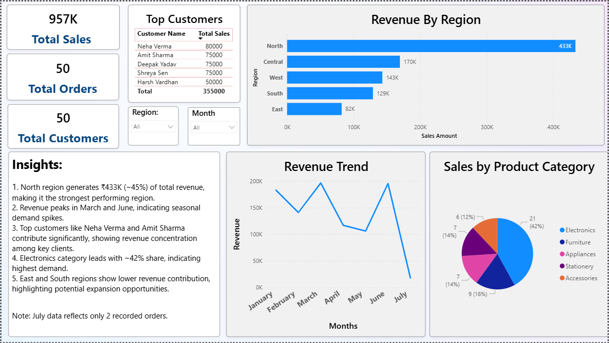

# Business Insights & Sales Performance Dashboard

Sales analytics dashboard built using SQL and Power BI to analyse revenue trends, customer behaviour, and product performance.

## Dashboard Preview

## Overview
This project analyses sales data to uncover key business insights and trends using SQL and Power BI. The dashboard provides a clear view of revenue distribution, customer contribution, and product performance.

## Tools Used
- SQL (Data extraction and transformation)
- Power BI (Dashboard and visualisation)
- Excel (Initial data handling)

## Key Features
- KPI tracking: Total Sales, Orders, Customers
- Revenue analysis by region
- Monthly revenue trend analysis
- Top customer identification
- Product category performance breakdown
- Interactive filters (Region, Month)

## Key Insights
- North region generates ₹433K (~45%) of total revenue, making it the strongest performing region.
- Revenue peaks in March and June, indicating seasonal demand patterns.
- Top customers contribute significantly to total revenue, highlighting dependency on key clients.
- Electronics category leads with ~42% share, showing highest demand.
- Lower contribution from East and South regions indicates potential growth opportunities.
- July data reflects only 2 recorded orders, which explains the sharp drop in revenue.

## Files
- `Business_Insights_Dashboard.pbix` — Power BI dashboard file
- `dashboard.png` — dashboard screenshot
- `README.md` — project documentation

## Conclusion
This project demonstrates the ability to analyse business data, identify patterns, and present actionable insights using Power BI.
